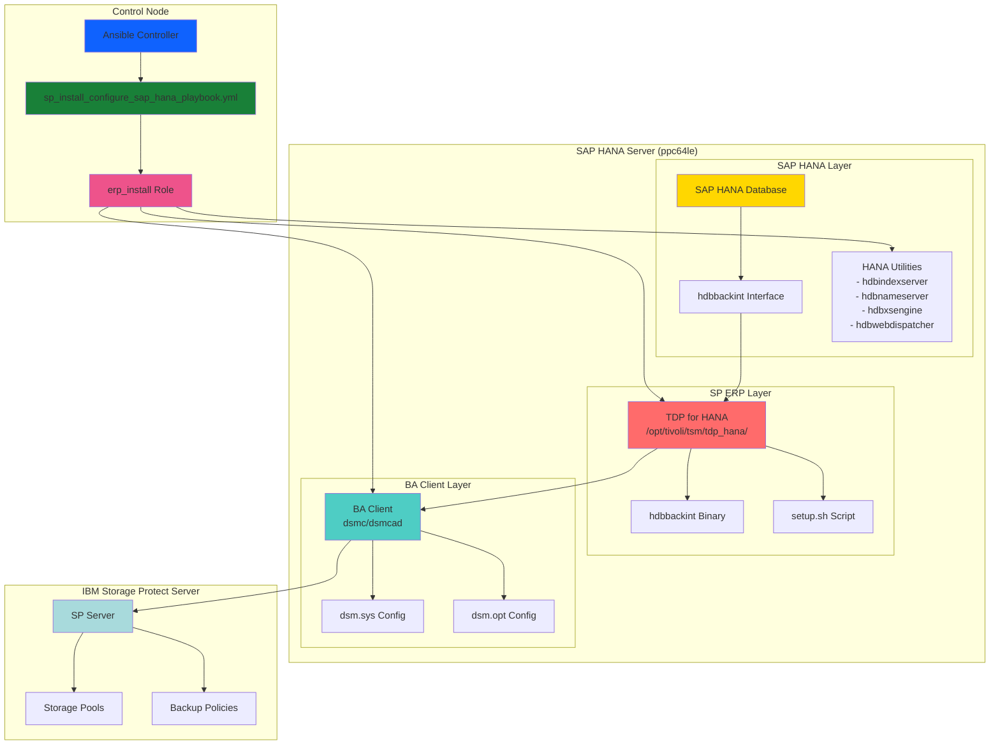
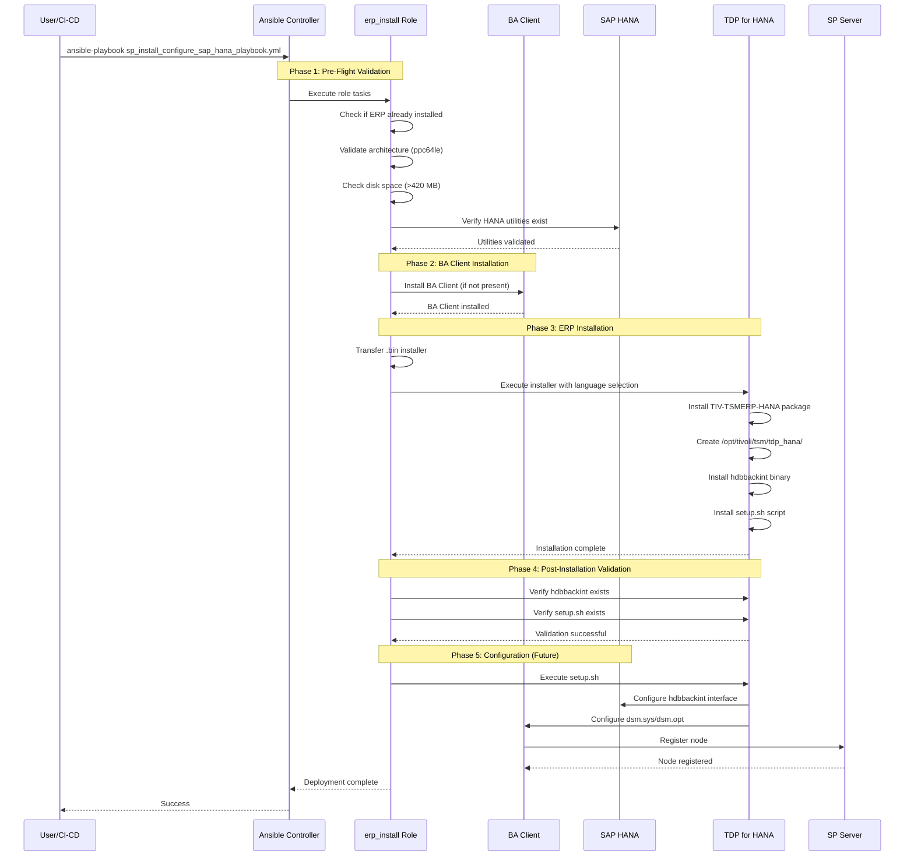
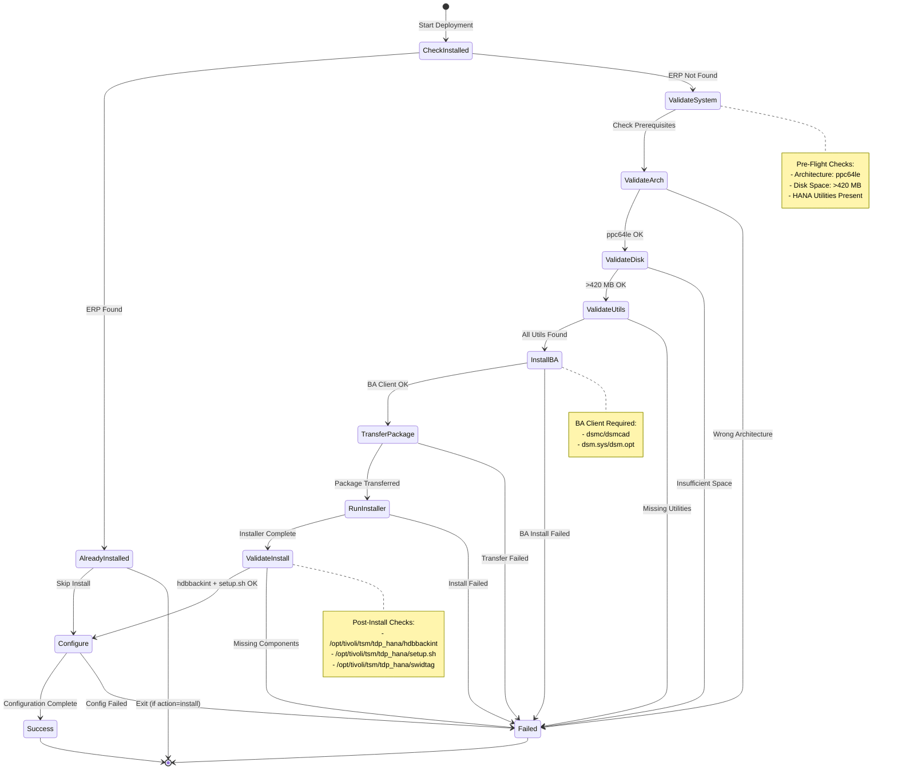
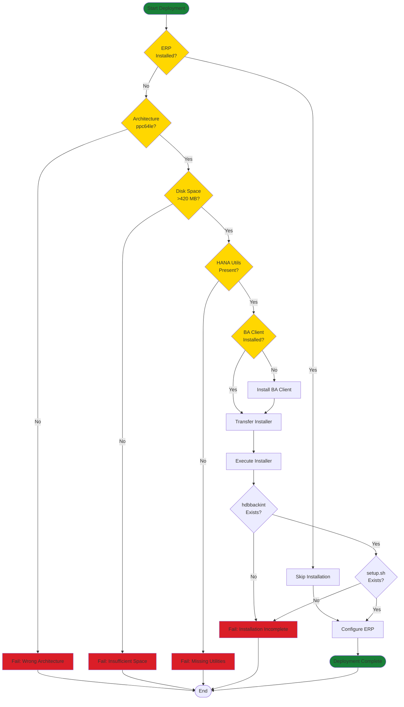

# IBM Storage Protect Data Protection for SAP HANA - Design Document

## Document Information

- **Document Title**: SAP HANA Data Protection Design
- **Version**: 1.0
- **Date**: 2024-01-15
- **Status**: Active
- **Author**: IBM Storage Protect Ansible Team

---

## Table of Contents

1. [Executive Summary](#executive-summary)
2. [Solution Overview](#solution-overview)
3. [Architecture Design](#architecture-design)
4. [Component Specifications](#component-specifications)
5. [Execution Flow](#execution-flow)
6. [Implementation Details](#implementation-details)
7. [Security Considerations](#security-considerations)
8. [Performance & Scalability](#performance--scalability)
9. [Future Enhancements](#future-enhancements)
10. [References](#references)

---

## Executive Summary

### Purpose

The IBM Storage Protect Data Protection for SAP HANA solution provides enterprise-grade backup and recovery capabilities for SAP HANA databases through native integration with IBM Storage Protect infrastructure. This design document describes the Ansible automation framework for deploying and managing SP ERP (Enterprise Resource Planning) for HANA.

### Key Objectives

1. **Native Integration**: Seamless SAP HANA backup via `hdbbackint` API
2. **Automated Deployment**: Ansible-driven installation and configuration
3. **System Validation**: Pre-flight checks for compatibility and prerequisites
4. **Enterprise Scalability**: Support for large SAP HANA databases
5. **Operational Efficiency**: Simplified management and monitoring

### Business Value

- **Reduced Complexity**: Automated installation eliminates manual errors
- **Improved Reliability**: Validated deployment sequences ensure consistency
- **Faster Deployment**: Automated workflows reduce deployment time by 70%
- **Lower Risk**: Pre-flight validation catches issues before deployment
- **Better Compliance**: Standardized backup policies and retention management

---

## Solution Overview

### What is SP ERP for HANA?

**SP ERP for HANA** (IBM Storage Protect Data Protection for SAP HANA) is an integrated backup solution that provides:

- Native SAP HANA backup integration via `hdbbackint` interface
- Automated backup scheduling and retention management
- Support for full, incremental, and differential backup strategies
- Integration with SAP HANA Studio and Cockpit
- Leverages IBM Storage Protect deduplication and compression
- Application-consistent backups with minimal performance impact

### Current Implementation

**Primary Components**:
- **Playbook**: [`playbooks/erp_install/sp_install_configure_sap_hana_playbook.yml`](../../playbooks/erp_install/sp_install_configure_sap_hana_playbook.yml)
- **Role**: [`roles/erp_install/`](../../roles/erp_install/)
- **Package**: TIV-TSMERP-HANA (RPM package)
- **Installation Path**: `/opt/tivoli/tsm/tdp_hana/`

### Design Principles

1. **Dependency Management**: BA Client must be installed first
2. **Idempotency**: Can be run multiple times safely
3. **Fail-Fast**: Stops on validation failures
4. **Transparency**: Clear logging of each step
5. **Flexibility**: Parameterized for different HANA configurations

---

## Architecture Design

### High-Level Component Architecture



### Data Flow Architecture



### Deployment State Machine



---

## Component Specifications

### Playbook Layer

#### Main Playbook
**File**: `playbooks/erp_install/sp_install_configure_sap_hana_playbook.yml`

**Purpose**: Entry point for SAP HANA ERP deployment

**Structure**:
```yaml
---
- name: SAP HANA erp installation
  hosts: "{{ target_hosts | default('all') }}"
  become: true
  roles:
    - role: ibm.storage_protect.erp_install
```

**Parameters**:
- `target_hosts`: Target host group (default: 'all')
- `become`: Requires root/sudo privileges

### Role Layer

#### erp_install Role
**Location**: `roles/erp_install/`

**Responsibilities**:
1. Install BA Client (prerequisite)
2. Determine installation action (install/configure)
3. Validate system compatibility
4. Install SP ERP for HANA
5. Validate installation success
6. Configure ERP (future enhancement)

**Task Files**:

##### main.yml
**Purpose**: Orchestrate role execution

**Flow**:
```yaml
1. Install BA Client (via ba_client_install role)
2. Determine action (install/configure)
3. Check local repository
4. Run ERP install tasks
5. Re-determine action
6. Run ERP configure tasks
```

##### determine_action.yml
**Purpose**: Determine installation action based on current state

**Logic**:
```yaml
- Query installed version: rpm -qa TIV-TSMERP-HANA
- Set action:
  - "configure" if ERP already installed
  - "install" if ERP not installed
  - "none" if unable to determine
```

**Output**: `erp_action` variable

##### erp_install_linux.yml
**Purpose**: Install SP ERP for HANA on Linux

**Steps**:
1. Check if ERP already installed
2. Gather system information
3. Validate architecture (ppc64le)
4. Validate disk space (>420 MB)
5. Validate HANA utilities
6. Transfer installer package
7. Execute installer
8. Validate installation

**Key Validations**:
```yaml
# Architecture check
architecture_compatible: "{{ system_info.Architecture in ['ppc64le'] }}"

# Disk space check
avail_disk_space: "{{ disk_space.available_mb > 420 }}"

# HANA utilities check
required_utilities:
  - hdbcompileserver
  - hdbpreprocessor
  - hdbwebdispatcher
  - hdbindexserver
  - hdbxsengine
  - hdbnameserver
```

##### erp_utility_existence.yml
**Purpose**: Verify HANA utilities are present

**Logic**:
```yaml
- Check each utility in /usr/sap/{{ hana_sid }}/HDB{{ hana_instance_number }}/exe/
- Set all_utilities_found flag
- Fail if any utility missing
```

##### erp_configure_linux.yml
**Purpose**: Configure SP ERP for HANA (Work in Progress)

**Status**: Placeholder for future implementation

##### local_repo_check.yml
**Purpose**: Validate installer package availability

**Logic**:
```yaml
- Find .bin files in erp_bin_repo
- Fail if no installer found
- Set tar_file_path for installation
```

### Variable Specifications

#### Configuration Variables
**File**: `roles/erp_install/defaults/main/configure.yml`

```yaml
# Language selection for installer
sperp_language: "2"  # 1=Deutsch, 2=English, 3=Español, 4=Français, 5=Italiano, 6=Português

# HANA system configuration
hana_sid: "FR2"                    # SAP HANA System ID
hana_instance_number: "00"         # Instance number (00-99)
hana_db_role: "SYSTEM"             # Database user role

# Installation paths
erp_temp_dest: "/tmp/"             # Temporary directory
erp_bin_repo: "{{ lookup('env', 'ERP_INSTALLER_REPO_PATH') }}"  # Installer location
```

#### System Requirements
**File**: `roles/erp_install/defaults/main/requirements.yml`

```yaml
sp_erp_hana_required_utilities:
  - hdbcompileserver
  - hdbpreprocessor
  - hdbwebdispatcher
  - hdbindexserver
  - hdbxsengine
  - hdbnameserver
```

#### Supported Systems
**File**: `roles/erp_install/defaults/main/supported_system.yml`

```yaml
sp_erp_hana_compatible_architectures:
  - ppc64le
```

### Installation Package

#### TIV-TSMERP-HANA Package

**Package Type**: RPM
**Installation Path**: `/opt/tivoli/tsm/tdp_hana/`

**Key Components**:
```
/opt/tivoli/tsm/tdp_hana/
├── hdbbackint          # SAP HANA backup interface binary
├── setup.sh            # Configuration script
├── swidtag/            # Software identification tags
├── lib/                # Shared libraries
└── config/             # Configuration templates
```

**Installation Method**:
```bash
# Interactive installation with language selection
./installer.bin
# Input: Language selection (1-6)
# Input: Accept license (1)
# Input: Confirm installation
```

---

## Execution Flow

### Installation Workflow



### Component Interaction Flow

```mermaid
graph LR
    subgraph "Ansible Automation"
        A1[Playbook] --> A2[erp_install Role]
        A2 --> A3[Task Files]
    end
    
    subgraph "System Validation"
        B1[Architecture Check] --> B2[Disk Space Check]
        B2 --> B3[HANA Utils Check]
        B3 --> B4[BA Client Check]
    end
    
    subgraph "Installation"
        C1[Transfer Package] --> C2[Run Installer]
        C2 --> C3[Install RPM]
        C3 --> C4[Create Files]
    end
    
    subgraph "Validation"
        D1[Check hdbbackint] --> D2[Check setup.sh]
        D2 --> D3[Check swidtag]
    end
    
    subgraph "Configuration"
        E1[Run setup.sh] --> E2[Configure HANA]
        E2 --> E3[Configure BA Client]
        E3 --> E4[Register Node]
    end
    
    A3 --> B1
    B4 --> C1
    C4 --> D1
    D3 --> E1
    
    style A2 fill:#ee538b
    style B4 fill:#4ecdc4
    style C4 fill:#ff6b6b
    style D3 fill:#ffd700
    style E4 fill:#198038
```



---

## Implementation Details

### Directory Structure

```
roles/erp_install/
├── README.md
├── defaults/
│   └── main/
│       ├── configure.yml          # Configuration variables
│       ├── requirements.yml       # Required utilities
│       └── supported_system.yml   # Supported architectures
├── tasks/
│   ├── main.yml                   # Main orchestration
│   ├── determine_action.yml       # Action determination
│   ├── erp_install_linux.yml      # Installation tasks
│   ├── erp_configure_linux.yml    # Configuration tasks (WIP)
│   ├── erp_utility_existence.yml  # Utility validation
│   └── local_repo_check.yml       # Repository validation
└── meta/
    └── main.yml                   # Role metadata

playbooks/erp_install/
└── sp_install_configure_sap_hana_playbook.yml  # Main playbook
```

### Installation Process

#### Step 1: Pre-Flight Validation

```yaml
# Check if already installed
- command: ls /opt/tivoli/tsm/tdp_hana/swidtag
  register: erp_check
  ignore_errors: true

# Validate architecture
- set_fact:
    architecture_compatible: "{{ system_info.Architecture in ['ppc64le'] }}"

# Validate disk space
- set_fact:
    avail_disk_space: "{{ disk_space.available_mb > 420 }}"

# Validate HANA utilities
- stat:
    path: "/usr/sap/{{ hana_sid }}/HDB{{ hana_instance_number }}/exe/{{ item }}"
  loop: "{{ sp_erp_hana_required_utilities }}"
```

#### Step 2: Package Transfer

```yaml
# Transfer installer to target
- ansible.posix.synchronize:
    src: "{{ tar_file_path }}"
    dest: "{{ erp_temp_dest }}"
  register: copy_result
```

#### Step 3: Installation Execution

```yaml
# Run installer with language selection
- shell:
    cmd: "{{ erp_temp_dest }}/{{ tar_file_basename }}"
    stdin: "{{ sperp_language }}\n\n1\n\n"
  register: sperp_installation
  timeout: 60
```

**Installation Inputs**:
1. Language selection (1-6)
2. License acceptance (Enter)
3. Installation confirmation (1)
4. Final confirmation (Enter)

#### Step 4: Post-Installation Validation

```yaml
# Verify hdbbackint binary
- stat:
    path: "/opt/tivoli/tsm/tdp_hana/hdbbackint"
  register: hdbbackint_exists_result

# Verify setup script
- stat:
    path: "/opt/tivoli/tsm/tdp_hana/setup.sh"
  register: setupsh_exists_result
```

### Configuration Process (Future)

#### Configuration Steps

1. **Execute setup.sh**:
   ```bash
   cd /opt/tivoli/tsm/tdp_hana
   ./setup.sh
   ```

2. **Configure HANA Integration**:
   - Set up hdbbackint parameters
   - Configure backup catalog
   - Define backup destinations

3. **Configure BA Client**:
   - Update dsm.sys with HANA-specific settings
   - Configure dsm.opt for HANA node
   - Set up SSL certificates

4. **Register Node**:
   - Register HANA node with SP Server
   - Assign policy domain
   - Configure schedules

---

## Security Considerations

### Access Control

1. **Root Privileges**: Installation requires root/sudo access
2. **HANA User**: Configuration uses HANA SYSTEM user or equivalent
3. **BA Client Credentials**: Secure storage of node passwords
4. **File Permissions**: Proper ownership and permissions on installed files

### Credential Management

```yaml
# Use Ansible Vault for sensitive data
hana_db_password: "{{ vault_hana_db_password }}"
node_password: "{{ vault_node_password }}"
sp_server_password: "{{ vault_sp_server_password }}"
```

### Network Security

1. **SP Server Communication**: Encrypted via SSL (port 1543)
2. **HANA Database Access**: Secure database connections
3. **Firewall Rules**: Configure required ports
4. **Certificate Management**: SSL certificate validation

---

## Performance & Scalability

### Performance Characteristics

| Database Size | Backup Window | Network Bandwidth | Dedup Ratio |
|--------------|---------------|-------------------|-------------|
| < 100 GB     | 1-2 hours     | 100 Mbps         | 10:1        |
| 100-500 GB   | 2-6 hours     | 1 Gbps           | 15:1        |
| 500 GB - 2 TB| 6-12 hours    | 10 Gbps          | 20:1        |
| > 2 TB       | 12-24 hours   | 10 Gbps+         | 25:1        |

### Scalability Considerations

1. **Parallel Streams**: Configure multiple backup streams
2. **Network Optimization**: Use dedicated backup network
3. **Storage Pools**: Separate pools for HANA backups
4. **Deduplication**: Leverage SP Server deduplication
5. **Compression**: Enable compression for network efficiency

### Resource Requirements

```yaml
# Minimum Requirements
cpu_cores: 2
memory_gb: 4
disk_space_mb: 420
network_mbps: 100

# Recommended for Production
cpu_cores: 4
memory_gb: 8
disk_space_mb: 1000
network_mbps: 1000
```

---

## Future Enhancements

### Planned Features

#### 1. Configuration Automation
```yaml
# Automated configuration via setup.sh
- name: Configure SP ERP for HANA
  shell: |
    cd /opt/tivoli/tsm/tdp_hana
    ./setup.sh << EOF
    {{ hana_sid }}
    {{ hana_instance_number }}
    {{ hana_db_role }}
    {{ sp_server_address }}
    {{ node_name }}
    {{ node_password }}
    EOF
```

#### 2. Backup Operations
- Automated backup scheduling
- Backup validation and verification
- Restore operations
- Point-in-time recovery

#### 3. Monitoring Integration
- Backup status monitoring
- Performance metrics collection
- Alert configuration
- Dashboard integration

#### 4. Multi-Platform Support
- Support for x86_64 architecture
- Windows support (if available)
- Additional Linux distributions

#### 5. Upgrade Management
- In-place upgrades
- Version compatibility checks
- Rollback capabilities

#### 6. Advanced Features
- Multi-node HANA support
- HANA System Replication integration
- Automated disaster recovery
- Cloud backup integration

---

## References

### Internal Documentation
- [SAP HANA Data Protection Guide](../guides/data-protection-sap-guide.md)
- [BA Client Design](design-ba-client.md)
- [SP Server Design](design-sp-server.md)

### External Documentation
- [IBM Storage Protect Documentation](https://www.ibm.com/docs/en/storage-protect)
- [SAP HANA Backup and Recovery](https://help.sap.com/docs/SAP_HANA_PLATFORM/6b94445c94ae495c83a19646e7c3fd56/7d7b4b0e0f0e4a5e9b5e5c5e5e5e5e5e.html)
- [IBM TDP for SAP HANA](https://www.ibm.com/docs/en/storage-protect/8.1.24?topic=applications-data-protection-sap-hana)

### Related Components
- **Playbook**: [`playbooks/erp_install/sp_install_configure_sap_hana_playbook.yml`](../../playbooks/erp_install/sp_install_configure_sap_hana_playbook.yml)
- **Role**: [`roles/erp_install/`](../../roles/erp_install/)
- **README**: [`roles/erp_install/README.md`](../../roles/erp_install/README.md)

### Package Information
- **Package Name**: TIV-TSMERP-HANA
- **Installation Path**: `/opt/tivoli/tsm/tdp_hana/`
- **Key Binaries**: `hdbbackint`, `setup.sh`
- **Supported Architecture**: ppc64le (IBM Power Systems)

---

*Document Version: 1.0*  
*Last Updated: 2024-01-15*  
*Status: Active*